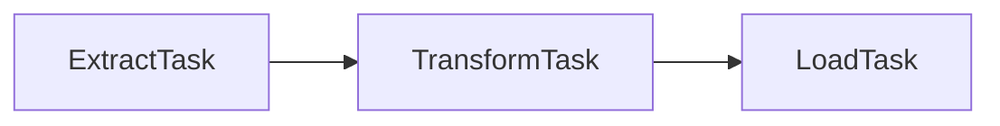
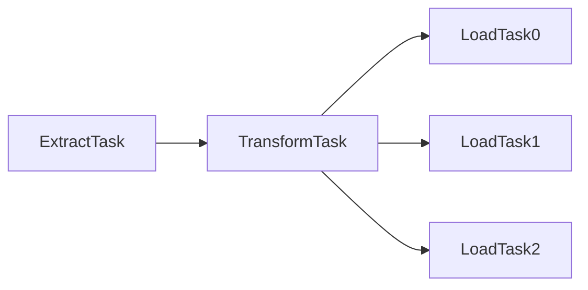

# Rettle

Rettle is a small experimental personal ETL framework

## Installation

in Gemfile

```
gem 'rettle', git: 'git@github.com:longicorn/rettle.git', branch: 'master'
```

```shell
$ bundle install
```

## Usage

### Simple Example



```ruby
etl = Rettle.new

etl.process(:extract, 'extract_task') do
  csv_path = '/path/to/csv/file'
  etl.connect('transform_task') do |senders|
    CSV.foreach(csv_path) do |row|
      senders['transform_task'].send(row)
    end
  end
end

etl.process(:transform, 'transform_task') do
  etl.connect('load_task') do |senders|
    task.each_recv do |row|
      row[:id] = row[:id].to_i
      senders['load_task'].send(row)
    end
  end
end

etl.process(:load, 'load_task') do
  task.each_recv do |row|
    puts row
  end
end
```

### Simple Example2



```ruby
etl = Rettle.new

etl.process(:extract, 'extract_task') do
  csv_path = '/path/to/csv/file'
  etl.connect('transform_task') do |senders|
    CSV.foreach(csv_path) do |row|
      senders['transform_task'].send(row)
    end
  end
end

etl.process(:transform, 'transform_task') do
  tasks = ['load_task0', 'load_task1', 'load_task2']
  etl.connect(tasks) do |senders|
    task.each_recv do |row|
      row[:id] = row[:id].to_i
      case row[:id] % 3
      when 0
        senders['load_task0'].send(row)
      when 1
        senders['load_task1'].send(row)
      when 2
        senders['load_task2'].send(row)
      end
    end
  end
end

etl.process(:load, 'load_task0') do
  task.each_recv do |row|
    puts row
  end
end

etl.process(:load, 'load_task1') do
  task.each_recv do |row|
    puts row
  end
end

etl.process(:load, 'load_task2') do
  task.each_recv do |row|
    puts row
  end
end
```
