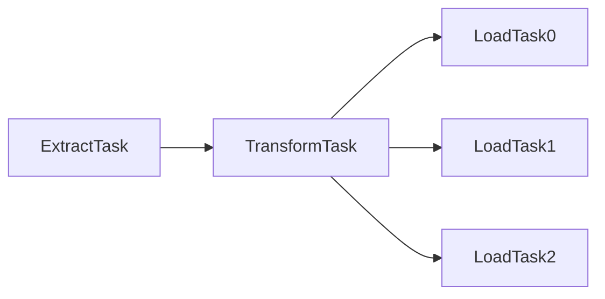

# Rettle

Rettle is a small experimental personal ETL framework

## Installation

in Gemfile

```
gem 'rettle', git: 'git@github.com:longicorn/rettle.git', branch: 'master'
```

```shell
$ bundle install
```

## Usage

### Simple Example


```ruby
etl = Rettle.new

etl.define_task(:extract, 'extract_task') do
  csv_path = '/path/to/csv/file'
  etl.connect('transform_task') do |senders|
    CSV.foreach(csv_path) do |row|
      senders['transform_task'].send(row)
    end
  end
end

etl.define_task(:transform, 'transform_task') do
  etl.connect('load_task') do |senders|
    task.each_recv do |row|
      row[:id] = row[:id].to_i
      senders['load_task'].send(row)
    end
  end
end

etl.define_task(:load, 'load_task') do
  task.each_recv do |row|
    puts row
  end
end

etl.run
```

### Simple Example2



```ruby
etl = Rettle.new

etl.define_task(:extract, 'extract_task') do
  csv_path = '/path/to/csv/file'
  etl.connect('transform_task') do |senders|
    CSV.foreach(csv_path) do |row|
      senders['transform_task'].send(row)
    end
  end
end

etl.define_task(:transform, 'transform_task') do
  tasks = ['load_task0', 'load_task1', 'load_task2']
  etl.connect(tasks) do |senders|
    task.each_recv do |row|
      row[:id] = row[:id].to_i
      case row[:id] % 3
      when 0
        senders['load_task0'].send(row)
      when 1
        senders['load_task1'].send(row)
      when 2
        senders['load_task2'].send(row)
      end
    end
  end
end

etl.define_task(:load, 'load_task0') do
  task.each_recv do |row|
    puts row
  end
end

etl.define_task(:load, 'load_task1') do
  task.each_recv do |row|
    puts row
  end
end

etl.define_task(:load, 'load_task2') do
  task.each_recv do |row|
    puts row
  end
end

etl.run
```

## Rettle Helper

## setup

`setup` executes all Tasks before starting them

```ruby
etl = Rettle.new
etl.setup do
  FileUtils.mkdir_p('dir/path')
end
```

## Task Helper
### Extract
#### download

download simple file

```ruby
etl = Rettle.new

etl.define_task(:extract, 'extract_task') do |task|
  csv_url = '/url/to/csv/file.csv'
  csv_paths = task.download(url: csv_url, dir: '/save/to/dir')
  CSV.foreach(csv_paths[0]) do |row|
    p row
  end
end
```

#### download 2

download zip file

```ruby
etl = Rettle.new

etl.define_task(:extract, 'extract_task') do |task|
  # file.zip => ['hoge.csv', 'hoge.asc']
  zip_url = '/url/to/csv/file.zip'

  # files => ['hoge.csv', 'hoge.asc']
  files = task.download(url: zip_url, dir: '/save/to/dir')
  csv_paths = files.detect(/.*\.csv/)
  CSV.foreach(csv_paths[0]) do |row|
    p row
  end
end
```

#### download 3

download with scraping

```ruby
etl = Rettle.new

etl.define_task(:extract, 'extract_task') do |task|
  def task.downloader
    # scraping code
    # ...
    return [file_path]
  end

  file_path = task.download(url: zip_url, dir: '/save/to/dir')[0]
  # ...
end
```

### Load

#### export
'export' caches the data and calls 'exporter' when it reaches a certain amount, to output the data to a file, etc.
The 'exporter' must be defined by the user.

```ruby
etl = Rettle.new

# original code
etl.define_task(:load, 'load_task') do |task|
  array = []
  task.each_recv do |row|
    array << row

    if array.size > 1000
      ActiveRecord::Base.transaction do
        array.each(&:save!)
      end
      array = []
   end
  end
  ActiveRecord::Base.transaction do
    array.each(&:save!)
  end if array.size > 0
end

# rewrite code
etl.define_task(:load, 'load_task') do |task|
  # 'data' is cached data
  def task.exporter(data)
    ActiveRecord::Base.transaction do
      data.each(&:save!)
    end
  end

  array = []
  task.each_recv do |row|
    # size is buffer size. default is 1000
    task.export(data: row, size: 2000)
  end
  task.export(flush: true)
end
```
